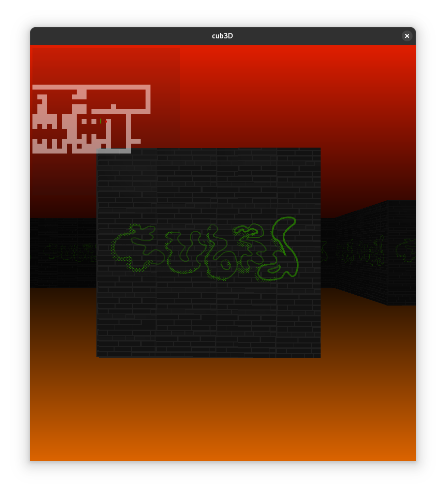

# Welcome to Cube3D

This is an implementation of the DDA ray tracing algorithm in the form of a simple graphical application. In fact, there is no 3D in this project, all the motion operations are carried out in 2D space

## Compile
Just run `make`

## Run
Run the compiled program with the following command: `./Cube3D <path to map.cub>`
```shell
$ ./Cube3D maps/default_map.cub
```

## Moves

- WASD - for moving
- Key left and right - for rotate
- Space - for capture the cursor to control the camera

<p align="center">
  
</p>